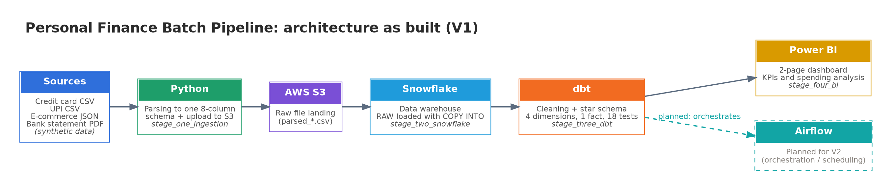
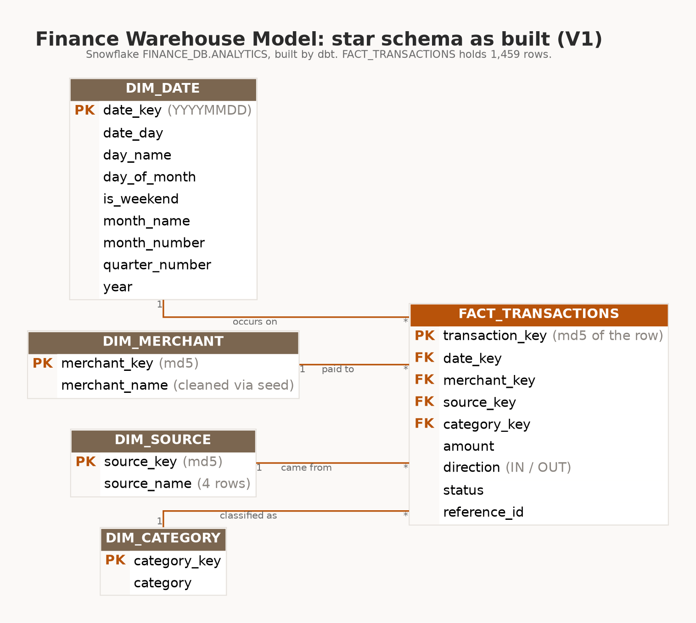
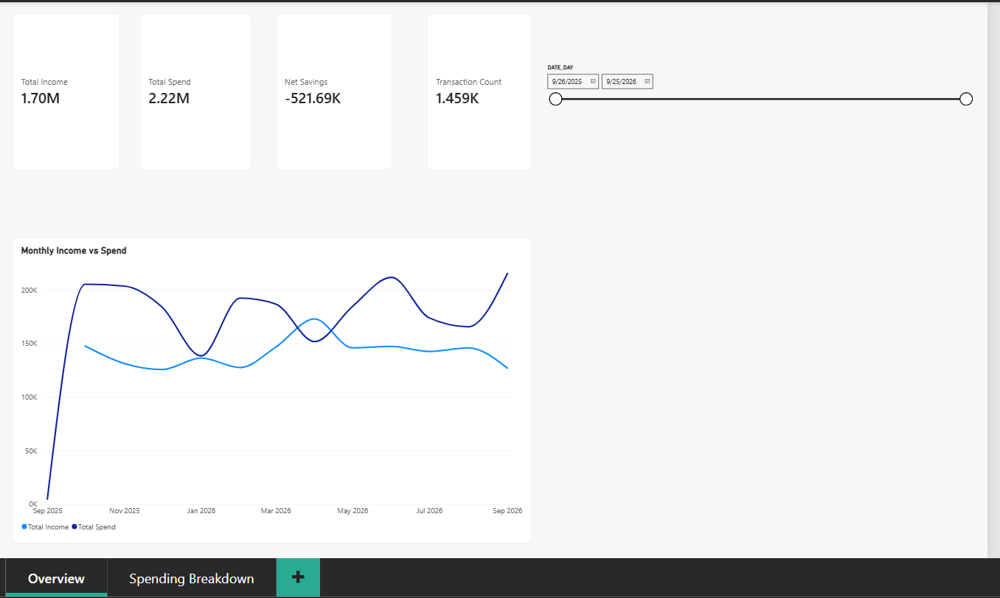
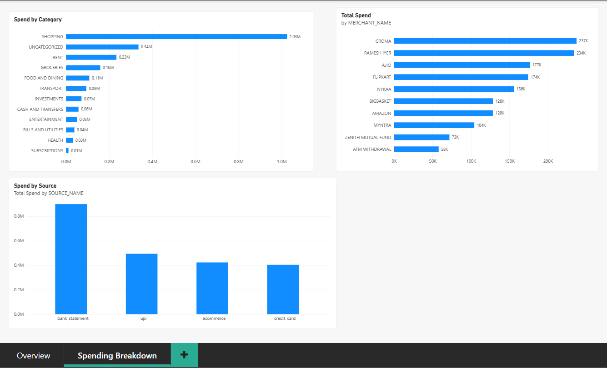

# 💳 Personal Finance Data Pipeline
### End-to-end batch data engineering project: Python → AWS S3 → Snowflake → dbt → Power BI

> I took messy money data from **4 different sources** (credit card, UPI, e-commerce, bank statement PDF), built a pipeline that cleans and loads it into a cloud warehouse, modelled it as a **star schema**, tested it, and turned it into a **dashboard** that answers: *"Where is my money going?"*



---

## 🎯 At a glance

| | |
|---|---|
| **What it is** | A batch ELT pipeline + analytics dashboard for personal finance data |
| **Data** | ~1,000 synthetic transactions, Sep 2025 – Sep 2026, from 4 source formats (CSV, JSON, PDF) |
| **Stack** | Python · AWS S3 · Snowflake · dbt · Power BI |
| **Warehouse design** | Star schema: 1 fact table + 4 dimensions |
| **Data quality** | 18 automated dbt tests, all passing |
| **Built** | Solo, end to end, stage by stage |

---

## 🧩 The problem

Money data never arrives clean. Each source speaks a different language:

- **Credit card** → CSV with cryptic merchant names (`MYNTRA.IN BANGALO...`)
- **UPI** → CSV where merchants are often person names
- **E-commerce orders** → JSON
- **Bank statement** → PDF

Nobody can answer simple questions (*How much did I spend last month? On what? Which source costs me most?*) until these are brought into **one trusted, consistent shape**. That is what this project does.

---

## 🏗️ How it works

```
 Sources (CSV / JSON / PDF)
        │
        ▼
 1. Python        parse 4 sources into one common 8-column format
        │
        ▼
 2. AWS S3        raw landing zone (files stored untouched)
        │
        ▼
 3. Snowflake     load raw data with COPY INTO  →  FINANCE_DB.RAW
        │
        ▼
 4. dbt           clean → model → test          →  FINANCE_DB.ANALYTICS
        │
        ▼
 5. Power BI      dashboard on top of the star schema
```

| Stage | Folder | What I built |
|---|---|---|
| 1. Ingestion | `stage_one_ingestion/` | Parsers for CSV, JSON and PDF (pandas, pdfplumber) that output one common schema; Python + boto3 upload to S3 |
| 2. Warehouse load | `stage_two_snowflake/` | Snowflake warehouse, database, schema, file format, external stage and raw table; `COPY INTO` load with validation checks |
| 3. Transformation | `stage_three_dbt/` | dbt staging view, merchant-cleaning seed, 4 dimensions, 1 fact table, 18 tests |
| 4. Reporting | `stage_four_bi/` | Power BI dashboard with 2 pages, measures written in DAX |

Detailed write-ups for each stage are in [`docs/notes/`](docs/notes/).

---

## ⭐ What makes this project worth a look

**1. Real-world messy data, not a tidy Kaggle file.**
Four sources, three file formats (CSV, JSON, PDF), inconsistent merchant names, and card bill payments that look like spending but are not.

**2. Proper data modelling.**
A star schema with a fact table and `dim_date`, `dim_merchant`, `dim_source`, `dim_category`, designed with deliberate scope decisions (documented below).

**3. Data quality is tested, not assumed.**
18 dbt tests (unique, not-null, relationships) protect the model. During the build I also caught and fixed a **non-unique transaction key** by making the hash handle empty values and include more fields, and confirmed that the fact row count equals the unique ID count.

**4. Business logic that matches reality.**
Credit card bill payments are excluded from *Total Spend* so spending is not double counted. Only successful transactions (POSTED / SUCCESS / DELIVERED) are counted in money measures.

**5. Security basics respected.**
No credentials in the code or the repo. Snowflake reads S3 through a **read-only IAM user**, and secrets are placeholders in the shared SQL.

**6. Honest scoping.**
I froze the architecture early, built a working V1 first, and kept out tools that were not needed (Kafka, Spark, Databricks, Glue, Lambda, Docker). Choosing *not* to add complexity was a deliberate engineering decision.

---

## 🗂️ Data model (star schema)



| Table | Purpose |
|---|---|
| `fact_transactions` | One row per transaction (amount, direction, status, keys to all dimensions) |
| `dim_date` | Calendar table, key in `YYYYMMDD` format |
| `dim_merchant` | Cleaned merchant names, built using a mapping seed (`merchant_mapping.csv`) |
| `dim_category` | Spending category (shopping, bills, etc.) |
| `dim_source` | Credit card, UPI, e-commerce, bank statement |

**Design decisions (V1):**
- Source-system level detail only (no individual account or card tracking)
- Plain overwrite for dimensions (no SCD Type 2) to keep V1 simple
- One raw table for all sources, because parsing already unifies them into one schema

---

## 📊 The dashboard

Built in **Power BI (Import mode)** connected directly to the Snowflake `ANALYTICS` schema.

**Page 1: Overview**
- KPI cards: Total Income, Total Spend, Net Savings, Transaction Count
- Monthly Income vs Spend trend (Sep 2025 – Sep 2026)
- Date slicer

**Page 2: Spending Breakdown**
- Spend by Category
- Top 10 Merchants
- Spend by Source

> More screenshots are in [`docs/screenshots/`](docs/screenshots/). The Power BI file is in `stage_four_bi/` and a PDF export is in [`docs/`](docs/finance_dashboard.pdf).




---

## 🛠️ Tech stack and skills shown

| Area | Tools / skills |
|---|---|
| Languages | Python (pandas, pdfplumber, python-dateutil, boto3), SQL, DAX |
| Cloud | AWS S3, IAM (least-privilege, read-only user) |
| Warehouse | Snowflake (warehouses, stages, file formats, `COPY INTO`) |
| Transformation | dbt (sources, staging, seeds, marts, tests) |
| Modelling | Dimensional modelling, star schema, surrogate keys |
| BI | Power BI (data model, relationships, DAX measures, visuals) |
| Practices | Raw/analytics layer separation, data validation, reproducibility, documentation, Git |

---

## 🚀 How to run it

> ⚠️ A Snowflake account and an AWS account are needed. Use your own credentials. Never commit keys.

```bash
# 1. Clone
git clone <your-repo-url>
cd finance_data_pipeline

# 2. Stage 1: parse sources and upload to S3
cd stage_one_ingestion
python -m venv .venv && .venv\Scripts\activate
pip install -r requirements.txt
python parsers.py          # builds the common-schema CSVs
python ingestion.py         # uploads the parsed files to your S3 bucket

# 3. Stage 2: run in a Snowflake worksheet
#    stage_two_snowflake/stage2_snowflake_load.sql
#    (replace the key placeholders with your own read-only IAM keys)

# 4. Stage 3: build the models and run tests
cd ../stage_three_dbt/finance_dbt
dbt seed
dbt build

# 5. Stage 4: open stage_four_bi/basic_measures.pbix in Power BI Desktop
#    and point it to your Snowflake ANALYTICS schema
```

---

## 📁 Repository structure

```
finance_data_pipeline/
├── source_data/            # synthetic raw data (4 sources)
├── stage_one_ingestion/    # Python parsing + S3 upload
├── stage_two_snowflake/    # Snowflake setup + load SQL
├── stage_three_dbt/        # dbt project (finance_dbt)
├── stage_four_bi/          # Power BI file
├── docs/                   # stage notes, dashboard PDF, screenshots
├── images/                 # architecture and data model diagrams
└── README.md
```

---

## 🧠 What I learned

- Parsing is half the job: deciding *what the parser should not do* (no de-duplication, no merchant cleanup) kept each stage simple and easy to debug.
- A unique key is only unique if you prove it. Row counts versus distinct key counts caught a real bug.
- Cloud setups fail in practice (my Snowflake storage integration kept failing with an `AssumeRole` error). I made a safe, documented alternative and moved on instead of getting stuck.
- Keeping scope small is what let me finish a complete working pipeline.

---

## 🔭 What's next (V2)

- [ ] **Orchestration with Apache Airflow** to run ingestion → load → dbt on a schedule
- [ ] Incremental loads and re-run safety (idempotency)
- [ ] Switch Snowflake access to a storage integration (role-based, no keys)
- [ ] Add SCD Type 2 for merchants and account-level detail
- [ ] Publish the dashboard online

---

## 📬 Contact

**[Your Name]**
Aspiring Data Engineer · Open to Data Engineer / Analytics Engineer roles
🔗 LinkedIn: `https://www.linkedin.com/in/therealbasha/`
💻 GitHub: `https://github.com/therealbashaa/`

*If this project helped or interested you, a ⭐ on the repo is appreciated!*

---

*Note: All data in this project is synthetic. No real personal or financial information is used.*
